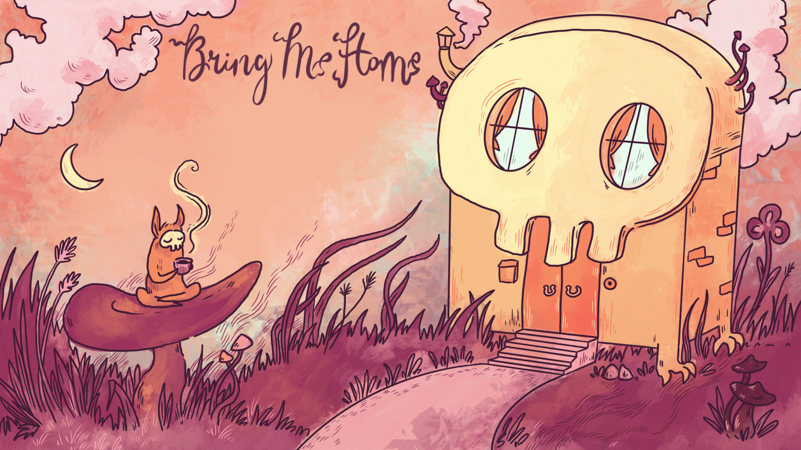

# Bring me Home (Inno Games Global Game Jam 2019)

Let's find the way home, together!
Bring me home is a Puzzle Game with an addictive road construction and turn mechanic. 
You have to guide the lost character in the Mushroomwoods around the scary monster, to his home. 

Playable at https://torbilicious.de/bring-me-home/

PC/MAC/LINUX/WEB:
Drag and Drop the street tiles and turn the road in the direction of your home :)

Achievement Unlocked: Under the Influence - The main character or vehicle can only be controlled indirectly. Example: placing barriers or obstacles to influence the movement.

## Created by Black Pipe Down

### Visuals
Maria Weninger
Inga Kriz
Svenja Kohlmann

### Programmers
Torben Binder
Alicja Wlochowitz
Marcel Bulla
Max Bebök

### Game Design/Management
Artjom Fransen

### Soundtrack
Elie Abraham